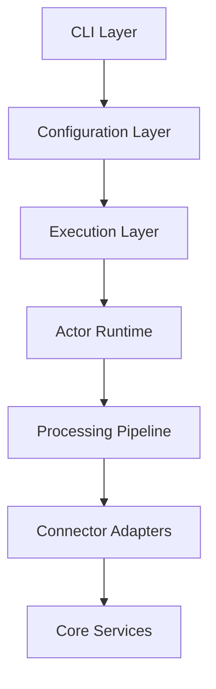

# Architecture Overview

This document explains Stratum's internal architecture and design principles.

## High-Level Architecture

Stratum is organized into layers, each with specific responsibilities:



See [architecture.mermaid](architecture.mermaid) for the complete detailed diagram.

## Layer Breakdown

### 1. CLI Layer (`crates/cli`)

**Responsibilities:**
- Command parsing (migrate, validate, test-conn, progress)
- Signal handling (SIGINT/SIGTERM)
- Graceful shutdown coordination

**Key Components:**
- Command handlers
- Signal traps
- User interface

---

### 2. Configuration & Planning Layer

**Responsibilities:**
- Parse SMQL syntax into AST
- Generate migration plans with deterministic hashing
- Validate configuration settings

**Key Components:**
- **SMQL Parser**: Converts declarative config to internal representation
- **Planner**: Creates execution plan with offset strategies
- **Validator**: Ensures configuration is valid before execution

---

### 3. Execution Orchestration (`crates/engine-runtime/executor`)

**Responsibilities:**
- Initialize global context (run_id, adapters, state)
- Set up StateStore (sled embedded KV database)
- Spawn worker tasks for each migration item

**Key Component:**
- **MigrationExecutor**: Coordinates the entire migration lifecycle

---

### 4. Actor Runtime Layer (`crates/engine-runtime/actor`)

**Responsibilities:**
- Orchestrate producer-consumer pipeline
- Manage actor mailboxes (MPSC channels)
- Publish events to subscribers

**Key Components:**

#### PipelineCoordinator
Orchestrates the snapshot lifecycle. Manages producer and consumer actors.

#### ProducerActor
- Receives messages: Start, Stop, Pause, Resume
- Reads data from source
- Applies transformations
- Sends batches to MPSC channel

#### ConsumerActor  
- Receives batches from MPSC channel
- Writes data to destination
- Updates checkpoints
- Reports metrics

#### EventBus
Pub/Sub system for migration events.

---

### 5. Data Processing Pipeline (`crates/engine-processing`)

This is where the actual data flows through the system.

#### Producer Side

**SnapshotReader**
- Paginates through source data
- Executes queries against source adapters
- Handles cursor positioning for resume

**TransformService**
- Table mapping (rename tables)
- Field mapping (rename/select columns)
- Computed transforms (expressions)
- Type coercion

**BatchCoordinator**
- Groups records into batches
- Sends batches to MPSC channel (capacity: 64)
- Provides backpressure control

#### MPSC Channel
Bounded channel with capacity of 64 batches. This provides:
- **Backpressure**: Producer slows down if consumer can't keep up
- **Decoupling**: Producer and consumer run independently
- **Memory control**: Limited in-flight data

#### Consumer Side

**BatchWriter**
- **Fast-path**: Uses PostgreSQL COPY protocol when possible
- **Fallback**: Uses INSERT/MERGE if fast-path not available
- Handles type encoding for destination

**StateManager**
- Tracks checkpoints after each successful batch
- Maintains write-ahead log (WAL)
- Enables crash recovery and resume

#### Circuit Breaker (`cb.rs`)
Protects against cascading failures:
- Exponential backoff: 1s → 2s → 4s → 8s → 16s → 30s (max)
- Failure threshold: 4 consecutive failures
- Opens circuit to prevent resource exhaustion

#### State Machine
Each pipeline transitions through states:
```
Working → Idle → Finished
```

### 6. Adapter Layer (`crates/connectors`)

Adapters provide a uniform interface to different data sources.

#### Source Adapters
- **MySqlAdapter**: Uses `mysql_async` for query execution
- **PostgresAdapter**: Uses `tokio-postgres` with connection pooling
- **CsvDataSource**: Parses CSV files with streaming

**Common Functionality:**
- Metadata introspection (schemas, tables, columns)
- Query generation with filters
- Cursor-based pagination

#### Destination Adapters
- **PgDestination**: PostgreSQL with COPY protocol (fastest)
- **DbDataDestination**: Generic SQL with INSERT/MERGE

**Common Functionality:**
- Type coercion and encoding
- Batch optimization
- Transaction management
- Error handling

---

### 7. Core Services Layer (`crates/engine-core`)

Foundation services used across all layers.

#### StateStore (sled KV)
Embedded key-value database stored in `~/.stratum/state/`
- Checkpoint tracking (cursor position, row counts)
- Write-ahead log (WAL)
- Migration progress
- Resume capability after crashes

#### Context System
- **GlobalContext**: Shared across all migrations (run_id, adapters, state_store)
- **ItemContext**: Per-migration context (source, destination, mappings, cursor)

#### Metrics
Atomic counters tracked in real-time:
- `records_processed`
- `bytes_transferred`
- `batches_processed`
- `failure_count`
- `retry_count`

#### Retry Policy & Circuit Breaker
Configurable retry behavior with exponential backoff.

#### Schema & Validation
- Schema inference from source databases
- Constraint detection (PKs, FKs, unique indexes)
- Type compatibility checking
- Coercion rules

#### Progress Tracking
- ProgressService queries StateStore
- Reports current stage, rows processed, cursor position
- Accessible via `stratum progress` CLI command

---

### 8. External Systems & Runtime

#### Tokio Runtime
Async runtime providing:
- Task spawning for concurrent operations
- MPSC channels for message passing
- Timers for retries and timeouts

#### Signal Handling
```
SIGINT/SIGTERM → CancellationToken → Graceful Shutdown
```
All actors receive shutdown signal and complete current batch before exiting.

---

## Data Flow

See [data-flow.mermaid](data-flow.mermaid) for the complete execution flow diagram.

### Typical Migration Flow

1. **User Request** → Parse SMQL config
2. **Parse** → Generate AST
3. **Plan** → Create MigrationPlan with hash
4. **Initialize** → Set up GlobalContext + StateStore
5. **For each MigrationItem:**
   - Create ItemContext (source, destination, mappings)
   - Load metadata (introspect schemas)
   - Validate settings
   - Spawn Pipeline (ProducerActor + ConsumerActor)
6. **Processing Loop:**
   - Producer reads → transforms → sends batches
   - Consumer receives → writes → checkpoints
   - Progress tracked via EventBus
7. **Completion** → All items processed → Shutdown

---

## Key Design Decisions

### Why Actor Model?
- **Isolation**: Actors have private state, communicate via messages
- **Concurrency**: Each actor runs in its own Tokio task
- **Supervision**: Failed actors can be restarted independently
- **Backpressure**: MPSC channels naturally provide flow control

### Why MPSC Channel with Capacity 64?
- **Memory bounded**: Prevents OOM from fast producers
- **Backpressure**: Producer blocks when channel is full
- **Latency vs throughput**: 64 balances response time with batch efficiency
- **Tunable**: Can be adjusted based on workload

### Why Sled for StateStore?
- **Embedded**: No external database required
- **Transactional**: ACID guarantees for checkpoints
- **Fast**: B+ tree with lock-free reads
- **Crash-safe**: Handles process crashes gracefully

### Why Separate Producer/Consumer?
- **Decoupling**: Source and destination can have different performance characteristics
- **Resilience**: Destination failures don't affect source reads
- **Observability**: Clear metrics for each side
- **Optimization**: Can tune batch sizes independently

---

## Performance Characteristics

### Throughput
- **MySQL/PostgreSQL**: 10K-50K rows/sec (depends on network, row size)
- **CSV**: 50K-100K rows/sec (local disk)
- **Bottleneck**: Usually the destination write speed

### Memory Usage
- **Baseline**: ~50MB for runtime
- **Per migration**: ~10-30MB (depends on batch size)
- **StateStore**: ~1-5MB (depends on checkpoint frequency)

### Latency
- **Checkpoint interval**: Every batch (configurable)
- **Retry backoff**: 1s → 30s exponential
- **Graceful shutdown**: <5s to drain in-flight batches

---

## Reliability Features

### Checkpoint & Resume
After each successful batch:
1. Update cursor position in StateStore
2. Record row count and timestamp
3. Commit transaction

On restart:
1. Load checkpoint from StateStore
2. Resume from last cursor position
3. Skip already-processed rows

### Circuit Breaker
Prevents cascading failures:
- Opens after 4 consecutive failures
- Exponential backoff up to 30s
- Resets on successful operation

### Graceful Shutdown
On SIGINT/SIGTERM:
1. Stop accepting new work
2. Drain in-flight batches
3. Write final checkpoint
4. Close connections
5. Exit cleanly

---

## Monitoring & Observability

### Built-in Metrics
Accessible via `stratum progress`:
- Current stage (snapshot/CDC)
- Records processed
- Bytes transferred
- Success/failure counts
- Current cursor position

### Event Bus
Subscribe to real-time events:
- `MigrationStarted`
- `BatchProcessed`
- `MigrationCompleted`
- `Error` events