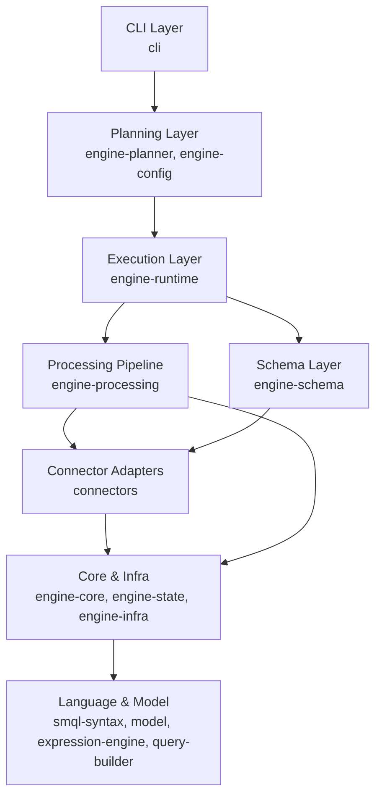

# Architecture Overview

This document explains Stratum's internal architecture and design principles.

## High-Level Architecture

Stratum is organized into 15 crates following a layered architecture:


```mermaid
graph TB
    CLI[CLI Layer<br/>cli] --> Planner[Planning Layer<br/>engine-planner, engine-config]
    Planner --> Runtime[Execution Layer<br/>engine-runtime]
    Runtime --> Processing[Processing Pipeline<br/>engine-processing]
    Processing --> Connectors[Connector Adapters<br/>connectors]
    Runtime --> Schema[Schema Layer<br/>engine-schema]
    Schema --> Connectors
    Connectors --> Core[Core & Infra<br/>engine-core, engine-state, engine-infra]
    Processing --> Core
    Core --> Lang[Language & Model<br/>smql-syntax, model, expression-engine, query-builder]
```

## Crate Map

| Crate | Layer | Responsibility |
|-------|-------|----------------|
| `model` | Language | Core domain types (`Value`, `Pipeline`, `Record`, transformations) |
| `smql-syntax` | Language | SMQL parser -> AST (pest-based) |
| `expression-engine` | Language | Expression evaluation (filters, computed columns, functions) |
| `query-builder` | Language | SQL AST + dialect-aware rendering |
| `connectors` | Data Access | MySQL, PostgreSQL, CSV drivers; unified `Driver` trait hierarchy |
| `engine-state` | Infrastructure | Sled embedded KV — checkpoints, WAL, crash recovery |
| `engine-infra` | Infrastructure | EventBus, Metrics, Progress, Retry utilities |
| `engine-schema` | Schema | Type system, DDL generation, FK dependency graph, schema planning |
| `engine-core` | Core Services | ExecutionContext, DriverRef, plan builder — re-exports state/schema/infra |
| `engine-config` | Config | SMQL -> validated settings, connection resolution |
| `engine-planner` | Planning | Execution plan analysis, metadata cache, diagnostics |
| `engine-processing` | Execution | Producer-consumer pipeline, transforms, Source/Sink/Destination abstractions |
| `engine-runtime` | Execution | DAG orchestrator, PipelineOrchestrator, actor coordination |
| `cli` | Interface | Commands (plan, apply, verify, ping), TUI, signal handling |
| `engine-tests` | Testing | Integration test suite (MySQL ↔ PostgreSQL, Sakila database) |

---

## Layer Breakdown

### 1. CLI Layer (`crates/cli`)

**Responsibilities:**
- Command parsing and dispatch
- Signal handling (SIGINT/SIGTERM -> CancellationToken)
- Graceful shutdown coordination
- Output modes: plain, pretty (colored), TUI (ratatui)

**Commands:**
- `plan` — dry-run analysis with optional sample data
- `apply` — execute migration
- `verify` — post-migration row count comparison
- `ping` — test database connectivity

**Global options:** `--env-file`, `--verbose`, `--quiet`, `--log-level`, `--log-file`, `--no-color`

---

### 2. Planning Layer (`crates/engine-planner`, `crates/engine-config`)

**Responsibilities:**
- Parse and validate SMQL configuration
- Build `ExecutionPlan` with deterministic hash (for resume identification)
- Resolve environment variables (`env("VAR", "default")`)
- Analyze pipelines: estimate row counts, detect schema mismatches

**Key Components:**
- **`engine-config`**: Loads SMQL -> `ExecutionPlan` with validated settings per pipeline
- **`engine-planner`**: Builds analysis context, caches table metadata via `MetadataCache<D>`

---

### 3. Execution Layer (`crates/engine-runtime`)

**Responsibilities:**
- Build and execute the pipeline DAG
- Initialize `ExecutionContext` (connection pool, state store, run_id)
- Spawn `PipelineOrchestrator` per pipeline, respecting dependency order

**Key Components:**

#### DAG Executor (`dag/executor.rs`)
- Builds a `Dag` from pipeline `after = [...]` declarations
- Topological sort determines execution levels
- Pipelines at the same level execute in parallel via `futures::stream`
- `DagExecutor::execute()` runs levels sequentially, pipelines within a level concurrently

#### PipelineOrchestrator (`execution/orchestrator.rs`)
- Owns a single pipeline's lifecycle end-to-end
- Runs schema ops (CREATE TABLE, indexes) before data migration
- Builds `PipelineCoordinator` -> spawns producer and consumer tasks
- Monitors completion or cancellation

#### ExecutionContext (`engine-core/context/exec.rs`)
- Shared across all pipelines in a run
- Holds connection pool (reuses drivers), `run_id`, `SledStateStore`, `EnvContext`
- `run_id` is deterministic: `"run-{plan_hash[:16]}"` — same plan always resumes the same state

---

### 4. Schema Layer (`crates/engine-schema`)

New in Phase 2. Handles schema object migration independent of data pipelines.

**Modules:**
- **`planner.rs`** — `SchemaPlanner`: introspects source schema, builds `SchemaPlan`
- **`plan.rs`** — `SchemaPlan`: column definitions, enum queries, dependency ordering, DDL generation
- **`dep_graph.rs`** — `DependencyGraph`: topological sort of tables by FK dependencies; `partial_topological_order()` handles cycles deterministically
- **`type_registry.rs`** — `TypeRegistry` + `TypeEngine`: source->destination type mapping per dialect
- **`graph_expander.rs`** — `GraphExpander`: expands FK graphs, builds `SchemaOps` (ordered DDL operations)
- **`schema_ops.rs`** — `SchemaOps`: ordered list of DDL ops (create table, create index, drop FK, add FK)
- **`metadata_cache.rs`** — `MetadataCache<D>`: caches `TableMetadata` keyed by table name
- **`row_counter.rs`** — `RowCounter<D>`: parallel row count queries
- **`converters/`** — Type converters: `MySqlToPostgres`, etc. with `Fidelity` ratings and `Transform` hints

**Three-Phase Schema Execution:**
```
Phase 1: CREATE TABLE (topologically sorted, FKs omitted)
Phase 2: Data migration (existing pipeline system)
Phase 3: CREATE INDEX + ALTER TABLE ADD CONSTRAINT (FK creation)
```

**Re-exported** via `engine-core`: `use engine_core::schema::*`

---

### 5. Processing Pipeline (`crates/engine-processing`)

The data pipeline. Runs one producer task and one consumer task per pipeline, communicating via a bounded MPSC channel.

```
Source (SnapshotReader)
  -> TransformService
  -> BatchCoordinator
  ↓ MPSC channel (capacity: 64 batches, backpressure)
Sink (BatchWriter)
  -> StateManager (checkpoint per batch)
  -> Metrics
```

#### IO Abstractions (`io/`)

| Module | Description |
|--------|-------------|
| `io/source/` | `Source` wraps `Arc<dyn DataReader>` + `Arc<dyn SchemaIntrospector>`; `DbSourceReader` handles pagination |
| `io/sink/` | `Sink` trait with `write_batch()`; `PostgresSink` uses COPY protocol |
| `io/destination.rs` | `Destination` wraps typed `Arc<PgDriver>` or future driver types |
| `io/driver.rs` | `SchemaDriver` trait alias used by planner analyzers |
| `io/filter/` | `FilterCompiler` trait; `SqlFilterCompiler` emits WHERE clauses |
| `io/format.rs` | `DataFormat` enum (MySql, Postgres, Csv) |
| `io/linked.rs` | `LinkedSource` for JOIN-resolved related tables |

#### PipelineContext (`context.rs`)
Per-pipeline execution context. Builder pattern. Holds:
- `exec_ctx: Arc<ExecutionContext>` — shared global context
- `source: Source`, `destination: Destination`
- `pipeline: Pipeline`, `mapping: TransformationMetadata`
- `offset_strategy`, `cursor` — for pagination and resume

#### Producer (`producer/`)
- `run_producer()` — standalone async function (not an actor struct)
- Reads pages via `SnapshotReader` with offset strategy (pk / numeric / timestamp)
- Applies `TransformService` (field mapping, computed columns, type coercion)
- Sends `Batch` values to MPSC channel

#### Consumer (`consumer/`)
- `run_consumer()` — standalone async function
- Receives batches, routes to appropriate `Sink`
- Writes checkpoint to `SledStateStore` after each batch
- Tracks metrics via `Metrics`

#### Circuit Breaker (`cb.rs`)
- Threshold: 4 consecutive failures
- Backoff: 1s -> 2s -> 4s -> 8s -> 16s -> 30s (max)
- Resets on success

---

### 6. Connector Layer (`crates/connectors`)

Provides a unified driver interface over MySQL, PostgreSQL, and CSV.

#### Driver Trait Hierarchy

```
Driver (Send + Sync + 'static)
├── SchemaIntrospector: Driver  — table/index/FK metadata
├── DataReader: Driver          — row fetching with filters
├── DataWriter: Driver          — row insertion (copy_rows, write_batch)
└── Transactional: Driver       — begin/commit/rollback
```

`DynIntrospector` — object-safe wrapper for `SchemaIntrospector` when needed as `dyn`.

`DriverRef` (in `engine-core`) — enum wrapping `Arc<MySqlDriver>` or `Arc<PgDriver>`; resolved via `dispatch_driver!` macro.

#### Available Drivers

| Driver | Read | Write | Schema | Notes |
|--------|------|-------|--------|-------|
| `MySqlDriver` | ✅ | ✅ | ✅ | `mysql_async`, TINYINT(1)->Boolean |
| `PgDriver` | ✅ | ✅ | ✅ | `tokio-postgres`, COPY protocol |
| CSV | ✅ | — | limited | streaming parse |

#### Metadata Structures (`sql/metadata/`)
- `TableMetadata` — columns, PKs, FKs, indexes, row count
- `ColumnMetadata` — name, type, nullable, default, full_column_type
- `IndexMetadata` / `IndexColumn` — index type, sort order, uniqueness
- `ForeignKeyMetadata` — composite FK support, ON DELETE/UPDATE actions

#### Type System (`drivers/{mysql,postgres}/types.rs`)
Each driver implements `IntoCanonical` producing `TypeMapping { canonical: Type, fidelity: Fidelity, value_transform: Option<Transform>, warnings }`.

Special conversions:
- MySQL `TINYINT(1)` -> `Type::Boolean` (via `Transform::IntToBool`)
- MySQL `ENUM` -> `Type::Varchar` + pre-DDL `CREATE TYPE` op
- `BIGINT UNSIGNED` -> `Type::Int64` with overflow warning

#### DriverRegistry (`registry.rs`)
Global singleton (`DriverRegistry::global()`) mapping URL schemes to driver factories. Built-in drivers registered at startup.

---

### 7. Infrastructure Layer (`crates/engine-state`, `crates/engine-infra`)

Extracted from `engine-core` to keep it slim. Re-exported via `engine-core`:
```rust
pub use engine_state as state;
pub use engine_infra::{event_bus, metrics, progress, retry};
```

#### StateStore (`engine-state`)
Sled embedded KV database at `~/.stratum/state/`:
- `SledStateStore` — ACID checkpoints with WAL
- Checkpoint stores: cursor position, row counts, timestamps
- Resume: on restart, load checkpoint and skip processed rows
- `WalEntry` model for write-ahead log entries

#### EventBus (`engine-infra/event_bus/`)
Pub/Sub for migration events:
- `MigrationStarted`, `BatchProcessed`, `MigrationCompleted`, `Error`
- Used by TUI and logging subscribers

#### Metrics (`engine-infra/metrics.rs`)
Atomic counters per pipeline:
- `records_processed`, `bytes_transferred`, `batches_processed`
- `failure_count`, `retry_count`

#### Retry (`engine-infra/retry.rs`)
Configurable retry policy with exponential backoff, used by circuit breaker.

---

### 8. Language Layer

| Crate | Description |
|-------|-------------|
| `smql-syntax` | pest-based parser -> AST (`PipelineBlock`, `ConnectionBlock`, etc.) |
| `model` | `Value`, `CanonicalValue`, `Record`, `Batch`, `Pipeline`, `Type`, `Transform`, execution types |
| `expression-engine` | Expression evaluator: binary ops, string/date/math functions, null handling |
| `query-builder` | SQL AST nodes + `Render` trait; dialect-specific rendering (MySQL, PostgreSQL); offset strategies |

---

## Data Flow

### Typical Migration

```
1. Parse SMQL  ->  AST  (smql-syntax)
2. Build plan  ->  ExecutionPlan + hash  (engine-config, engine-core)
3. Analyze     ->  MetadataCache, row counts, diagnostics  (engine-planner)
4. Initialize  ->  ExecutionContext (connection pool, SledStateStore, run_id)
5. Build DAG   ->  topological levels from after=[...] declarations
6. Per level (parallel):
   For each pipeline:
     a. Schema ops  ->  CREATE TABLE (phase 1)
     b. Data migration:
          Producer: paginate -> transform -> batch -> MPSC channel
          Consumer: receive -> write -> checkpoint
     c. Schema ops  ->  CREATE INDEX + ADD FK (phase 3)
7. Completion  ->  final metrics, shutdown
```

### Resume After Crash

```
1. Load ExecutionPlan (same hash -> same run_id)
2. For each pipeline: load checkpoint from SledStateStore
3. Skip already-processed rows (cursor position)
4. Continue from last checkpoint
```

---

## Key Design Decisions

### Standalone Async Functions Instead of Actor Structs
Producer and consumer are `run_producer()`/`run_consumer()` async functions using `tokio::select!` rather than actor structs with mailboxes. This simplifies the code while retaining the same concurrency and cancellation properties.

### DAG-Based Parallelism
Pipelines declare dependencies via `after = [...]`. Topological sort produces execution levels; all pipelines within a level run in parallel. Independent pipelines get maximum throughput; dependent pipelines are automatically serialized.

### Two-Phase FK Creation
FKs are created after data migration to prevent constraint violations during bulk insert. Schema ops use three phases: create tables -> migrate data -> create indexes and FKs.

### Deterministic `partial_topological_order()` for FK Cycles
When FK dependencies form a cycle (mutual references, self-references), a BFS-based `partial_topological_order()` places acyclic tables first, then cycle members alphabetically. This produces deterministic DDL regardless of `HashMap` iteration order.

### Bounded MPSC Channel (capacity: 64)
Provides natural backpressure — producer blocks when consumer can't keep up. Bounds memory regardless of source speed. Capacity is a tuning parameter.

### Sled for StateStore
Embedded, no external dependency, ACID-transactional, B+ tree with lock-free reads, crash-safe WAL. Checkpoints are written after every batch so crash recovery loses at most one batch.

### DriverRef + dispatch_driver! Macro
Instead of `Arc<dyn Driver>` (which loses type information), `DriverRef` is an enum over concrete driver types. The `dispatch_driver!` macro generates match arms, allowing monomorphic dispatch without dynamic dispatch overhead on hot paths.

---

## Performance Characteristics

| Metric | Value |
|--------|-------|
| MySQL/PostgreSQL throughput | 10K–50K rows/sec (network-bound) |
| CSV throughput | 50K–100K rows/sec (disk-bound) |
| Baseline memory | ~50MB |
| Per-pipeline memory | ~10–30MB (batch-size dependent) |
| MPSC channel capacity | 64 batches |
| Checkpoint interval | Every batch |
| Retry backoff | 1s -> 30s exponential |
| Graceful shutdown | <5s to drain in-flight batches |

---

## Reliability Features

### Checkpoint & Resume
After each successful batch: cursor position + row counts committed to Sled. On restart: same `run_id` (deterministic from plan hash) -> load checkpoint -> resume from cursor.

### Circuit Breaker
4 consecutive failures -> circuit opens. Exponential backoff (1s…30s). Resets on next success. Prevents resource exhaustion from flapping destinations.

### Graceful Shutdown
SIGINT/SIGTERM -> `CancellationToken::cancel()` -> all `tokio::select!` arms wake -> current batch drains -> final checkpoint -> clean exit (code 130 for SIGINT).

---

## Monitoring & Observability

### Structured Logging
`tracing` crate with configurable level (`--log-level`). Log to stderr or file (`--log-file`). `RUST_LOG` env var also respected.

### Metrics
Per-pipeline atomic counters accessible via `EventBus` subscribers. TUI (`--tui`) renders live progress bars. `--pretty` mode prints colored progress to stdout.

### Event Bus
Real-time events: `MigrationStarted`, `BatchProcessed`, `MigrationCompleted`, `PipelineError`. Subscribers registered before execution; TUI and logger are built-in subscribers.
