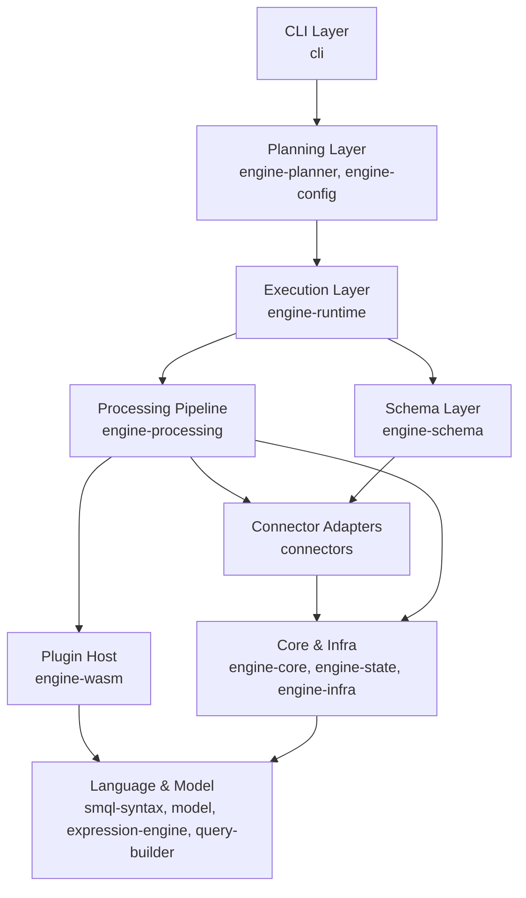

# Architecture Overview

## High-Level Architecture

Stratum is organized into 18 workspace crates following a layered architecture
(plus the plugin SDK crates, which are excluded from the workspace because they
build for `wasm32` targets):


```mermaid
graph TB
    CLI[CLI Layer<br/>cli] --> Planner[Planning Layer<br/>engine-planner, engine-config]
    Planner --> Runtime[Execution Layer<br/>engine-runtime]
    Runtime --> Processing[Processing Pipeline<br/>engine-processing]
    Processing --> Connectors[Connector Adapters<br/>connectors]
    Processing --> Wasm[Plugin Host<br/>engine-wasm]
    Runtime --> Schema[Schema Layer<br/>engine-schema]
    Schema --> Connectors
    Connectors --> Core[Core & Infra<br/>engine-core, engine-state, engine-infra]
    Wasm --> Lang
    Processing --> Core
    Core --> Lang[Language & Model<br/>smql-syntax, model, expression-engine, query-builder]
```

## Crate Map

| Crate | Layer | Responsibility |
|-------|-------|----------------|
| `model` | Language | Core domain types (`Value`, `Pipeline`, `Record`, transformations) |
| `smql-syntax` | Language | SMQL parser -> AST (pest-based) |
| `expression-engine` | Language | Expression evaluation (filters, computed columns, functions) |
| `query-builder` | Language | SQL AST + dialect-aware rendering |
| `connectors` | Data Access | MySQL, PostgreSQL, CSV drivers; unified `Driver` trait hierarchy |
| `engine-state` | Infrastructure | Sled embedded KV - checkpoints, WAL, run state, integrity receipts; plus the append-and-sort log holding per-row integrity hashes |
| `engine-infra` | Infrastructure | EventBus, Metrics, Progress, Retry utilities |
| `engine-schema` | Schema | Type system, DDL generation, FK dependency graph, schema planning |
| `engine-core` | Core Services | ExecutionContext, DriverRef, plan builder - re-exports state/schema/infra |
| `engine-config` | Config | SMQL -> validated settings, connection resolution |
| `engine-planner` | Planning | Execution plan analysis, metadata cache, diagnostics |
| `engine-wasm` | Execution | WASM plugin host: registry, wasmtime runtime, resource limits, host<->guest wire |
| `engine-processing` | Execution | Producer-consumer pipeline, transforms, Source/Sink/Destination abstractions |
| `engine-runtime` | Execution | DAG orchestrator, PipelineOrchestrator, actor coordination |
| `engine-verify` | Verification | Re-reads the destination and diffs it against the migration's Merkle receipt |
| `cli` | Interface | Commands (plan, apply, verify, ping), TUI, signal handling |
| `engine-tests` | Testing | Integration test suite (MySQL ↔ PostgreSQL, Sakila database) |
| `sdk/stratum-plugin-compiler` | Tooling | Compiles plugin sources to WASM modules for `stratum plugin` |

---

## Layer Breakdown

### 1. CLI Layer (`crates/cli`)

**Responsibilities:**
- Command parsing and dispatch
- Signal handling (SIGINT/SIGTERM -> CancellationToken)
- Graceful shutdown coordination
- Output modes: plain, pretty (colored), TUI (ratatui)

**Commands:**
- `plan` - dry-run analysis with optional sample data
- `apply` - execute migration
- `resume` - continue a paused or interrupted run from its checkpoints
- `pause` - signal a running migration to stop at a batch boundary
- `status` - report run state, per-pipeline progress, and stored receipts
- `reset` - clear a migration's state: run state, checkpoints, WAL. It does
  not currently remove the row-hash log or the integrity receipts, which are
  keyed by pipeline rather than by run
- `verify` - post-migration integrity check: re-reads the destination and diffs it
  against the migration's keyed Merkle receipt, reporting missing/extra/changed
  rows by primary key (see [verification.md](verification.md))
- `plugin` - inspect, validate, and compile WASM plugins
- `ping` - test database connectivity
- `version` - build information

**Global options:** `--env-file`, `--verbose`, `--quiet`, `--log-level`, `--log-file`, `--no-color`

---

### 2. Planning Layer (`crates/engine-planner`, `crates/engine-config`)

**Responsibilities:**
- Parse and validate SMQL configuration
- Build `ExecutionPlan` with deterministic hash (for resume identification)
- Resolve environment variables (`env("VAR", "default")`)
- Analyze pipelines: estimate row counts, detect schema mismatches

**Key Components:**
- **`engine-config`**: Loads SMQL -> `ExecutionPlan` with validated settings per pipeline
- **`engine-planner`**: Builds analysis context, caches table metadata via `MetadataCache<D>`

---

### 3. Execution Layer (`crates/engine-runtime`)

**Responsibilities:**
- Build and execute the pipeline DAG
- Initialize `ExecutionContext` (connection pool, state store, run_id)
- Spawn `PipelineOrchestrator` per pipeline, respecting dependency order

**Key Components:**

#### DAG Executor (`dag/executor.rs`)
- Builds a `Dag` from pipeline `after = [...]` declarations
- Topological sort determines execution levels
- Pipelines at the same level execute in parallel via `futures::stream`
- `DagExecutor::execute()` runs levels sequentially, pipelines within a level concurrently

#### PipelineOrchestrator (`execution/orchestrator.rs`)
- Owns a single pipeline's lifecycle end-to-end
- Runs schema ops (CREATE TABLE, indexes) before data migration
- Builds `PipelineCoordinator` -> spawns producer and consumer tasks
- Monitors completion or cancellation

#### ExecutionContext (`engine-core/context/exec.rs`)
- Shared across all pipelines in a run
- Holds connection pool (reuses drivers), `run_id`, `SledStateStore`, `RowHashLog`, `EnvContext`
- `run_id` is deterministic: `"run-{plan_hash[:16]}"` - same plan always resumes the same state

---

### 4. Schema Layer (`crates/engine-schema`)

New in Phase 2. Handles schema object migration independent of data pipelines.

**Modules:**
- **`planner.rs`** - `SchemaPlanner`: introspects source schema, builds `SchemaPlan`
- **`plan.rs`** - `SchemaPlan`: column definitions, enum queries, dependency ordering, DDL generation
- **`dep_graph.rs`** - `DependencyGraph`: topological sort of tables by FK dependencies; `partial_topological_order()` handles cycles deterministically
- **`type_registry.rs`** - `TypeRegistry` + `TypeEngine`: source->destination type mapping per dialect
- **`graph_expander.rs`** - `GraphExpander`: expands FK graphs, builds `SchemaOps` (ordered DDL operations)
- **`schema_ops.rs`** - `SchemaOps`: ordered list of DDL ops (create table, create index, drop FK, add FK)
- **`metadata_cache.rs`** - `MetadataCache<D>`: caches `TableMetadata` keyed by table name
- **`row_counter.rs`** - `RowCounter<D>`: parallel row count queries
- **`converters/`** - Type converters: `MySqlToPostgres`, etc. with `Fidelity` ratings and `Transform` hints

**Three-Phase Schema Execution:**
```
Phase 1: CREATE TABLE (topologically sorted, FKs omitted)
Phase 2: Data migration (existing pipeline system)
Phase 3: CREATE INDEX + ALTER TABLE ADD CONSTRAINT (FK creation)
```

**Re-exported** via `engine-core`: `use engine_core::schema::*`

---

### 5. Processing Pipeline (`crates/engine-processing`)

The data pipeline. Runs one producer task and one consumer task per pipeline, communicating via a bounded MPSC channel.

```
Source (SnapshotReader)
  -> TransformService
  -> BatchCoordinator
  ↓ MPSC channel (bounded: 4 batches OR 128 MiB, whichever binds first; backpressure)
Sink (BatchWriter)
  -> StateManager (checkpoint per batch)
  -> Metrics
```

#### IO Abstractions (`io/`)

| Module | Description |
|--------|-------------|
| `io/source/` | `Source` wraps `Arc<dyn DataReader>` + `Arc<dyn SchemaIntrospector>`; `db/` handles pagination, `csv/` reads files, `wasm/` reads from a plugin |
| `io/sink/` | `Sink` trait with `write_batch()`; `PostgresSink` uses COPY, `MySqlSink` uses LOAD DATA, `WasmSinkAdapter` hands batches to a plugin |
| `io/destination.rs` | `Destination` wraps typed `Arc<PgDriver>` or future driver types |
| `io/driver.rs` | `SchemaDriver` trait alias used by planner analyzers |
| `io/filter/` | `FilterCompiler` trait; `SqlFilterCompiler` emits WHERE clauses |
| `io/format.rs` | `DataFormat` enum (MySql, Postgres, Csv) |
| `io/linked.rs` | `LinkedSource` for JOIN-resolved related tables |

#### PipelineContext (`context.rs`)
Per-pipeline execution context. Builder pattern. Holds:
- `exec_ctx: Arc<ExecutionContext>` - shared global context
- `source: Source`, `destination: Destination`
- `pipeline: Pipeline`, `mapping: TransformationMetadata`
- `offset_strategy`, `cursor` - for pagination and resume

#### Producer (`producer/`)
- `Producer` drives one pipeline's read side: pages via `SnapshotReader` with an
  offset strategy (pk / numeric / timestamp), then `TransformService` (field
  mapping, computed columns, type coercion, plugin stages)
- `BatchCoordinator` groups rows into batches, hashes and keys them when
  `--integrity` is on, and sends `Batch` values to the MPSC channel

#### Consumer (`consumer/`)
- Receives batches, routes to the appropriate `Sink`
- Writes a checkpoint to `SledStateStore` after each batch
- Tracks metrics via `Metrics`

> The **actors** that drive these live in `engine-runtime/src/actor/`:
> `run_producer()` and `run_consumer()` each own a mailbox
> (`mpsc::Receiver<ProducerMsg>` / `ConsumerMsg`) and `select!` over it alongside
> their work, supervised by `PipelineCoordinator`, which holds the senders and
> spawns both tasks. `engine-processing` owns the machinery; `engine-runtime`
> owns the actors that drive it.

#### Circuit Breaker (`cb.rs`)
- Threshold: 4 consecutive failures
- Backoff: 1s -> 2s -> 4s -> 8s -> 16s -> 30s (max)
- Resets on success

---

### 6. Plugin Host (`crates/engine-wasm`)

User code runs as sandboxed WebAssembly, written in Rust or JavaScript, at four
points in the pipeline (`PluginType`):

| Kind | Where it runs | Wired through |
|---|---|---|
| `Transform` | rewrites a row's fields in the transform stage | `transform/wasm.rs` |
| `Filter` | accepts or rejects a row in the validation stage | `transform/pipeline.rs` |
| `Source` | replaces the database reader | `WasmSourceEndpoint` -> `WasmSourceReader` (+ its own introspector, so a plugin source can create the destination table) |
| `Sink` | replaces the database writer | `Destination` -> `WasmSinkAdapter` |

A connection with `driver = "wasm"` resolves to `DataFormat::Wasm`, which is what
selects the plugin endpoint instead of a database one. All four are covered by
integration tests, including a source-to-sink pipeline with no database on either
end, resume from a plugin source, and `verify` over a plugin-sourced migration.

#### Runtime
- **wasmtime** with Cranelift and a module cache; one `PluginInstance` per plugin
  per pipeline, guarded by a mutex.
- **`ResourceLimits` per call** - 128 MB guest memory, plus fuel (~1 per WASM
  instruction), output size, and a wall-clock budget. For transform/filter those
  three are *per-row rates* scaled by the batch size (1M fuel / 1 MiB / 1s per
  row, capped at 256 MiB and 30s); source/sink plugins get flat per-call budgets
  (100M fuel / 16 MiB / 30s). A plugin cannot hang, allocate without bound, or
  return an unbounded payload.
- **`PluginRuntime`** distinguishes native guests from JavaScript ones, because a
  JS plugin boots QuickJS inside the guest and needs far more fuel than a native
  one; the host sizes the limits accordingly.

#### The host<->guest boundary is batched, not per row
A whole batch crosses in a single call. `columnar_v1` serializes the batch
column-by-column into a binary wire, the guest iterates the rows internally and
returns one batch back; `json_v1` remains for debugging and older guests. This is
why a native-Rust plugin runs near the no-plugin rate: the remaining cost is the
guest's own compute. A JavaScript plugin lands ~4x slower, and that gap is the
QuickJS interpreter executing guest code, not the boundary.

Plugin authoring, the SDK macros, and the metadata contract are covered in
[docs/plugins/](plugins/README.md).

---

### 7. Connector Layer (`crates/connectors`)

Provides a unified driver interface over MySQL, PostgreSQL, and CSV.

#### Driver Trait Hierarchy

```
Driver (Send + Sync + 'static)
├── SchemaIntrospector: Driver  - table/index/FK metadata
├── DataReader: Driver          - row fetching with filters
├── DataWriter: Driver          - row insertion (copy_rows, write_batch)
└── Transactional: Driver       - begin/commit/rollback
```

`DriverRef` (`engine-core/src/drivers/mod.rs`) - enum wrapping `Arc<MySqlDriver>` or `Arc<PgDriver>`; resolved via the `dispatch_driver!` macro, which is how callers reach a concrete driver's trait impls without a `dyn` layer.

#### Available Drivers

| Driver | Read | Write | Schema | Notes |
|--------|------|-------|--------|-------|
| `MySqlDriver` | ✅ | ✅ | ✅ | `mysql_async`, LOAD DATA fast-path, TINYINT(1)->Boolean |
| `PgDriver` | ✅ | ✅ | ✅ | `tokio-postgres`, COPY protocol |
| CSV | ✅ | - | limited | streaming parse |

#### Metadata Structures (`sql/metadata/`)
- `TableMetadata` - columns, PKs, FKs, indexes, row count
- `ColumnMetadata` - name, type, nullable, default, full_column_type
- `IndexMetadata` / `IndexColumn` - index type, sort order, uniqueness
- `ForeignKeyMetadata` - composite FK support, ON DELETE/UPDATE actions

#### Type System (`drivers/{mysql,postgres}/types.rs`)
Each driver implements `IntoCanonical` producing `TypeMapping { canonical: Type, fidelity: Fidelity, value_transform: Option<Transform>, warnings }`.

Special conversions:
- MySQL `TINYINT(1)` -> `Type::Boolean` (via `Transform::IntToBool`)
- MySQL `ENUM` -> `Type::Varchar` + pre-DDL `CREATE TYPE` op
- `BIGINT UNSIGNED` -> `Type::Int64` with overflow warning

---

### 8. Infrastructure Layer (`crates/engine-state`, `crates/engine-infra`)

Extracted from `engine-core` to keep it slim. Consumers depend on them directly -
`engine-core` exposes only `context`, `drivers`, `error`, `plan`, and `utils`, and
no longer re-exports the infrastructure crates under aliases.

#### StateStore (`engine-state/store`)
Sled embedded KV database at `~/.stratum/state/`:
- `SledStateStore` - ACID checkpoints with WAL
- Checkpoint stores: cursor position, row counts, timestamps
- Resume: on restart, load checkpoint and skip processed rows
- `WalEntry` model for write-ahead log entries
- `MerkleStore` - integrity receipts, one per pipeline and table

#### RowHashLog (`engine-state/log`)
A peer of the store, not part of it, at `~/.stratum/state/rowhash/`. Per-row
integrity hashes are bulk data with a narrow access pattern - appended once, read
back once in key order, deleted - so they live in an append-only log sorted by
external merge sort rather than in the key-value store, which would charge
per-record index memory for an index nothing queries. Memory stays flat with
table size; disk carries the set (~51 bytes/row). See
[verification.md](verification.md#row-hashes).

`engine-state` also holds `CalibrationData` - a small, separate sled db at
`~/.stratum/calibration` recording achieved throughput per destination write
path. `apply` records into it; `plan` reads it to estimate duration from this
machine's real rates instead of a cold-start prior (see [plan.md](plan.md)). It's
a regenerable cache, independent of the run state store.

#### EventBus (`engine-infra/event_bus/`)
Pub/Sub over `MigrationEvent` (32 variants in `model/events/migration.rs`):
- Run lifecycle: `Started`, `Completed`, `Failed`, `Paused`, `Resumed`, `Cancelled`
- Actor lifecycle: `ProducerStarted`/`Stopped`, `ConsumerStarted`/`Stopped`
- Per batch: `BatchRead`, `BatchWritten`, `BatchProcessed`, `BatchRetrying`, `BatchFailed`
- Used by TUI and logging subscribers

#### Metrics (`engine-infra/metrics.rs`)
Atomic counters per pipeline:
- `records_processed`, `bytes_transferred`, `batches_processed`
- `rows_skipped`, `rows_failed`
- `failure_count`, `retry_count`

#### Retry (`engine-infra/retry.rs`)
Configurable retry policy with exponential backoff, used by circuit breaker.

#### Shutdown (`engine-infra/shutdown.rs`)
`ShutdownSignal` - the cancellation token pair the CLI drives from SIGINT/SIGTERM
and `pause` uses to stop a run at a batch boundary.

---

### 9. Language Layer

| Crate | Description |
|-------|-------------|
| `smql-syntax` | pest-based parser -> AST (`PipelineBlock`, `ConnectionBlock`, etc.) |
| `model` | `Value`, `CanonicalValue`, `Record`, `Batch`, `Pipeline`, `Type`, `Transform`, execution types |
| `expression-engine` | Expression evaluator: binary ops, string/date/math functions, null handling |
| `query-builder` | SQL AST nodes + `Render` trait; dialect-specific rendering (MySQL, PostgreSQL); offset strategies |

---

## Data Flow

### Typical Migration

```
1. Parse SMQL  ->  AST  (smql-syntax)
2. Build plan  ->  ExecutionPlan + hash  (engine-config, engine-core)
3. Analyze     ->  MetadataCache, row counts, diagnostics  (engine-planner)
4. Initialize  ->  ExecutionContext (connection pool, SledStateStore, run_id)
5. Build DAG   ->  topological levels from after=[...] declarations
6. Per level (parallel):
   For each pipeline:
     a. Schema ops  ->  CREATE TABLE (phase 1)
     b. Data migration:
          Producer: paginate -> transform -> batch -> MPSC channel
          Consumer: receive -> write -> checkpoint
     c. Schema ops  ->  CREATE INDEX + ADD FK (phase 3)
     d. With --integrity: seal the row-hash log, fold the Merkle root,
        write one VerificationReceipt per table
7. Completion  ->  final metrics, shutdown
```

### Resume After Crash

```
1. Load ExecutionPlan (same hash -> same run_id)
2. For each pipeline: load checkpoint from SledStateStore
3. Skip already-processed rows (cursor position)
4. Continue from last checkpoint
```

---

## Key Design Decisions

### Actors as Async Functions, Not Structs
Producer and consumer are actors in the usual sense - each owns a mailbox (`ProducerMsg` / `ConsumerMsg`), processes control messages (`StartSnapshot`, `Start`, `Flush`, `Stop`) interleaved with its work via `tokio::select!`, and is supervised by `PipelineCoordinator`, which holds the senders and spawns both tasks. What is deliberately absent is the *struct* wrapper: the loop is a free function taking its receiver and dependencies as arguments, rather than a type with a `handle()` method and internal state. Same concurrency, cancellation, and supervision properties, less ceremony.

> **CDC is scaffolding, not a feature.** `ProducerMsg::StartCdc`, the
> `CdcStarted`/`CdcStopped` events, `ProducerMode::Cdc`, and
> `PipelineCoordinator::start_cdc{,_pipeline}` all exist, but nothing calls them -
> no config reaches them, and `ProducerMode::Cdc`'s tick body is a sleep with a
> `// CDC logic here` placeholder. Stratum does snapshot/batch migration only;
> change-data-capture is planned. Treat those paths as a reserved shape.

### DAG-Based Parallelism
Pipelines declare dependencies via `after = [...]`. Topological sort produces execution levels; all pipelines within a level run in parallel. Independent pipelines get maximum throughput; dependent pipelines are automatically serialized.

### Two-Phase FK Creation
FKs are created after data migration to prevent constraint violations during bulk insert. Schema ops use three phases: create tables -> migrate data -> create indexes and FKs.

### Deterministic `partial_topological_order()` for FK Cycles
When FK dependencies form a cycle (mutual references, self-references), a BFS-based `partial_topological_order()` places acyclic tables first, then cycle members alphabetically. This produces deterministic DDL regardless of `HashMap` iteration order.

### Bounded MPSC Channel (4 batches or 128 MiB)
The producer -> consumer channel is bounded two ways, whichever binds first: by batch count (`BATCH_CHANNEL_CAPACITY = 4`) and by in-flight bytes (`MAX_INFLIGHT_BYTES = 128 MiB`). The byte bound is the wide-row guard - a batch of very wide rows draws proportionally more of the budget, so the window can't balloon on wide tables. This provides natural backpressure (the producer blocks when the consumer can't keep up) and bounds per-lane memory regardless of source speed or table size. The depth was deliberately kept shallow: a deep channel just parks more fully-materialized batches in RAM without improving throughput - extra read-ahead only helps if the consumer has spare capacity to drain it, which the slower side (usually the write, or per-row transform CPU) doesn't. Per-lane footprint scales with lane count, not table size - see [benchmarks.md](benchmarks.md).

### Sled for StateStore
Embedded, no external dependency, ACID-transactional, B+ tree with lock-free reads, crash-safe WAL. Checkpoints are written after every batch so crash recovery loses at most one batch. It holds the small keyed records: checkpoints, WAL entries, run state, and integrity receipts.

### A Log, Not the KV Store, for Row Hashes
Per-row integrity hashes have the opposite shape to everything else in the state store: appended once, read back once in key order, deleted, and never looked up by key. Storing them in the B+ tree charged per-record index memory for an index nothing queries - measured at ~0.4-0.7 KB resident per 40-byte record, which put a ten-million-row table into gigabytes and out of memory. They live instead in an append-only log sorted once by external merge sort (`engine-state/log`), which keeps memory flat with table size and moves the cost to disk. The two mechanisms sit side by side in the state directory and share nothing else.

### DriverRef + dispatch_driver! Macro
Instead of `Arc<dyn Driver>` (which loses type information), `DriverRef` is an enum over concrete driver types. The `dispatch_driver!` macro generates match arms, allowing monomorphic dispatch without dynamic dispatch overhead on hot paths.

### mimalloc as the Global Allocator
The CLI sets [mimalloc](https://github.com/microsoft/mimalloc) as the `#[global_allocator]` (`crates/cli/src/main.rs`). The producer/consumer pipeline is allocation-heavy - every row carries owned column values (`String`, `BigDecimal`, `Vec`) that are allocated on read and freed after encoding, so a load churns hundreds of millions of short-lived allocations. On a high-core machine the default glibc allocator spreads these across many per-thread arenas and holds freed memory in them rather than returning it to the OS, which inflated peak RSS ~2–3× as a pure artifact (unrelated to the bounded in-flight window the pipeline actually keeps). mimalloc keeps peak RSS flat and returns memory to the OS promptly; it also modestly improved throughput on the churn-heavy path. This is a link-time choice with no code impact beyond the one `global_allocator` line - see the note in `crates/cli/Cargo.toml`. Peak-RSS numbers and the full rationale are in [benchmarks.md](benchmarks.md).

---

## Performance Characteristics

Structural bounds, fixed by the code (not machine-dependent):

| Metric | Value |
|--------|-------|
| MPSC channel bound | 4 batches or 128 MiB (whichever binds first) |
| Checkpoint interval | Every batch |
| Retry backoff | 1s -> 30s exponential |
| Graceful shutdown | <5s to drain in-flight batches |

Behavioral shape (for measured figures see [benchmarks.md](benchmarks.md), which
records the box they were taken on - treat any absolute number as
machine-specific, not a reference spec):

- **The bottleneck depends on the workload.** For a plain bulk copy it's usually
  the destination write - the COPY / `LOAD DATA` into the target (PostgreSQL
  binary COPY is the fastest target; InnoDB `LOAD DATA` is slower because every
  write maintains the clustered index). Heavy per-row work - many computed
  columns, or a WASM/JS plugin - shifts it to expression/plugin CPU instead, and
  a slow source or a remote network link can bind too.
- **`lanes = N` trades connections and memory for total throughput**, scaling
  sublinearly and flattening near the destination's ingest ceiling past ~2 lanes.
- **Integrity costs ~0.3-0.5 µs per row**, near enough constant across workloads -
  so it reads as ~15% on a plain copy, up to ~23% on the fastest ones, and nothing
  measurable on a workload already bound by expression evaluation. Row hashing runs
  in-flight, overlapped with the write; the finalize step that sorts the keyed set
  and folds the Merkle root is serial and does land on the wall clock.
- **Peak RSS is bounded and roughly flat** regardless of table size (the
  in-flight window is capped); it scales with lane count, not row count.
  mimalloc keeps it flat and returns freed memory to the OS.

---

## Reliability Features

### Checkpoint & Resume
After each successful batch: cursor position + row counts committed to Sled. On restart: same `run_id` (deterministic from plan hash) -> load checkpoint -> resume from cursor.

### Circuit Breaker
4 consecutive failures -> circuit opens. Exponential backoff (1s…30s). Resets on next success. Prevents resource exhaustion from flapping destinations.

### Graceful Shutdown
SIGINT/SIGTERM -> `CancellationToken::cancel()` -> all `tokio::select!` arms wake -> current batch drains -> final checkpoint -> clean exit (code 130 for SIGINT).

---

## Monitoring & Observability

### Structured Logging
`tracing` crate with configurable level (`--log-level`). Log to stderr or file (`--log-file`). `RUST_LOG` env var also respected.

### Metrics
Per-pipeline atomic counters accessible via `EventBus` subscribers. TUI (`--tui`) renders live progress bars. `--pretty` mode prints colored progress to stdout. See [output-modes.md](output-modes.md) for the CLI output modes and the TUI dashboard.

### Event Bus
`MigrationEvent` covers the run lifecycle (`Started`, `Completed`, `Failed`,
`Paused`, `Resumed`, `Cancelled`), the per-pipeline actors (`ProducerStarted`,
`ConsumerStopped`, …), and per-batch progress (`BatchRead`, `BatchWritten`,
`BatchProcessed`, `BatchRetrying`, `BatchFailed`), each carrying `run_id`,
`item_id`, and a timestamp. Subscribers are registered before execution; the TUI
and logger are built in.
